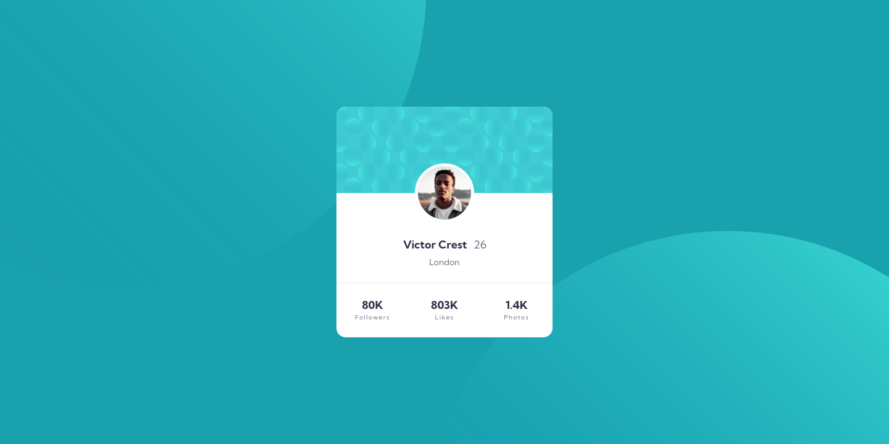

# Frontend Mentor - Profile card component solution

This is a solution to the
[Profile card component challenge on Frontend Mentor](https://www.frontendmentor.io/challenges/profile-card-component-cfArpWshJ).
Frontend Mentor challenges help you improve your coding skills by building
realistic projects.

## Table of contents

- [Frontend Mentor - Profile card component solution](#frontend-mentor---profile-card-component-solution)
  - [Table of contents](#table-of-contents)
  - [Overview](#overview)
    - [The challenge](#the-challenge)
    - [Screenshot](#screenshot)
    - [Links](#links)
    - [Built with](#built-with)
    - [Learned](#learned)
  - [Author](#author)

**Note: Delete this note and update the table of contents based on what sections
you keep.**

## Overview

### The challenge

- Build out the project to the designs provided

### Screenshot

### Links

- Solution URL:
  [Solution](https://github.com/metrikspacex/profile-card-component/)
- Live Site URL: [Site](https://metrikspacex.github.io/profile-card-component/)

### Built with

- [React](https://react.dev/) - React library
- [Vite] (https://vitejs.dev/) - Frontend tooling

### Learned

- Learned a bit about position relative, absolute and background-position
- Major issues I had was with the top and bottom svg positioning and will have
  to do more reading on this.

## Author

- Frontend Mentor -
  [@metrikspacex](https://www.frontendmentor.io/profile/metrikspacex)
